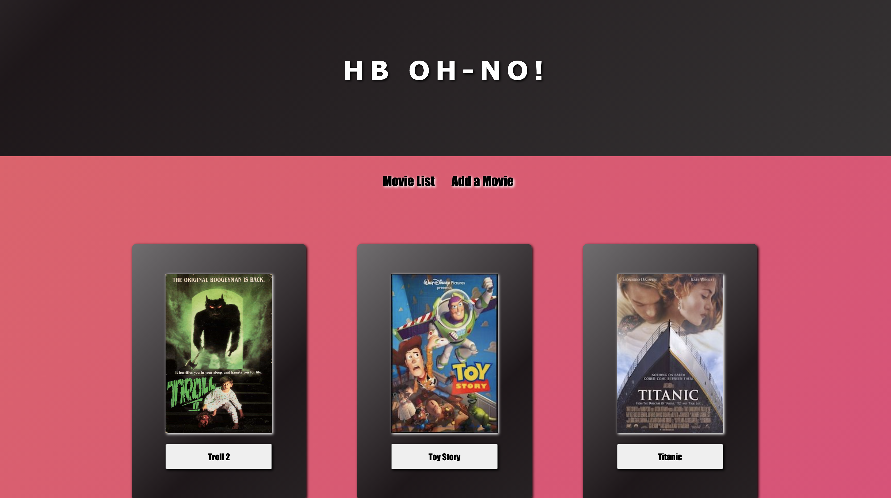
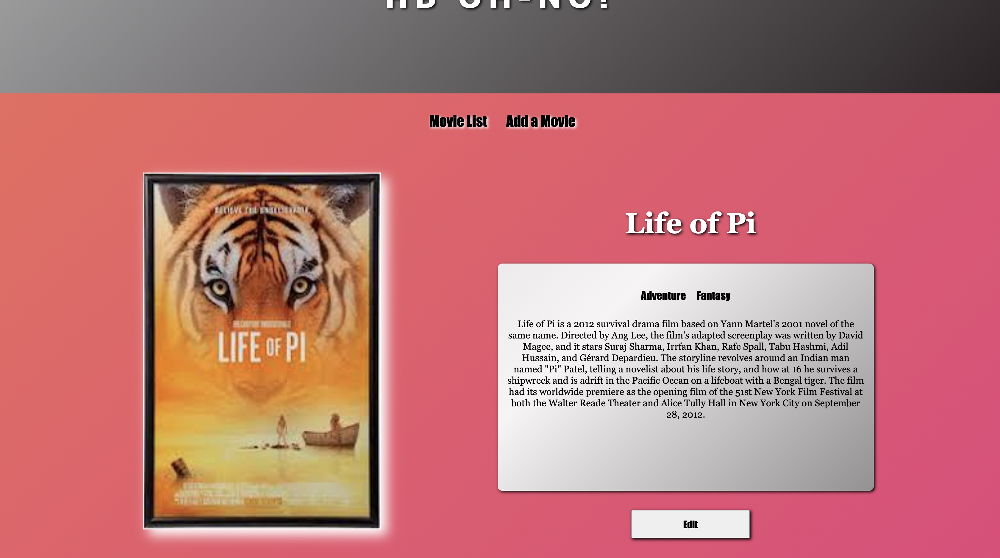

# PROJECT NAME

MOVIE-SAGAS

## Description

_Duration: 10 Hours_

This is an application that demonstrates the use of react-redux, joining databases, and working with sagas. The example topic is movies.

## Screen Shot

### Prerequisites - dependencies

- [Node.js](https://nodejs.org/en/)
- [postgreSQL](https://www.postgresql.org/download/)
- [react-redux](https://redux.js.org/introduction/installation)
- [materialUI](https://material-ui.com/getting-started/installation/)

### SQL Requirements
- PostgreSQL

1. Create a postgres SQL database named `saga_movies_weekend` using an app like Postico.
2. The queries in the `database.sql` file are set up to create all the necessary tables and populate the needed data to allow the application to run correctly. 
3. Open up your editor of choice and run an `npm install` - this will install the dependencies.
4. Run the server first `npm run server`.
5. Run the client second (in a separate terminal) `npm run client`.
6. The `npm run client` command will open up a new browser tab for you!

## Usage

1. Users are directed to a Home page that displays a list of movies.
2. Clicking on a movie will route you to another page which includes the details about the movie.
3. There is a Movie Form page that allows the user to add a movie to the database, which will then be displayed on the movie list page. 
4. A user may edit the title or description of a current movie.

## Built With

List technologies and frameworks here
- HTML
- CSS
- javaScript
- react
- redux
- node
- axios
- nodemon
- express
- postgreSQL
- material UI-core
- redux-logger
- redux-saga

## License

## Acknowledgement

Thank you to Josie and Steven, for being my coding buddies, for supporting me, and answering all my questions. Thanks to [Prime Digital Academy](www.primeacademy.io) who equipped and helped me to make this application a reality. Special thanks to my primary instructor, 
-[Mary Mossman](https://github.com/mbMosman)
-[Josie Fredericksen](https://github.com/freder48)
-[Steven Maloney](https://github.com/sdeda1us)

## Support

If you have suggestions or issues, please reach out to me on linkedIn [https://www.linkedin.com/in/kimberly-orchard-she-her-49b0171b9/]
